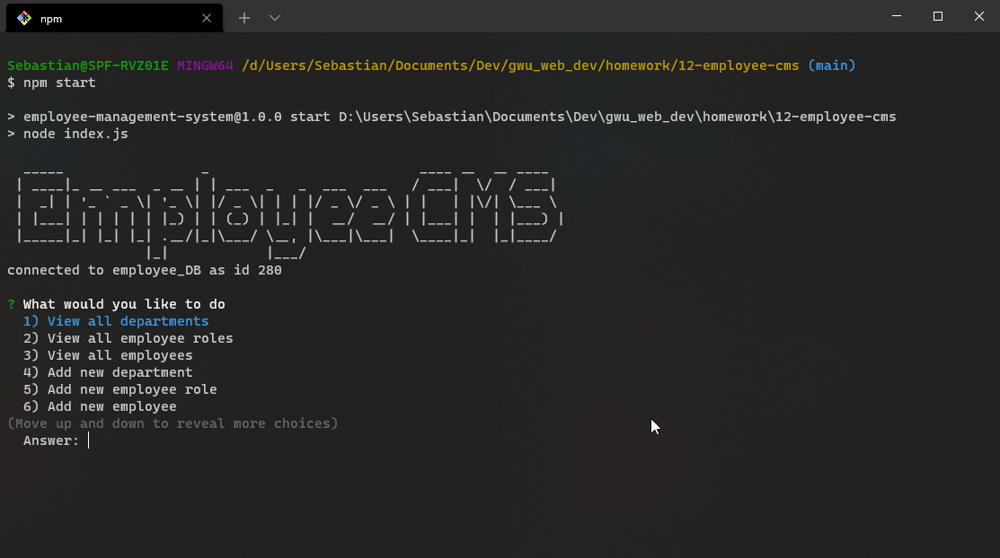
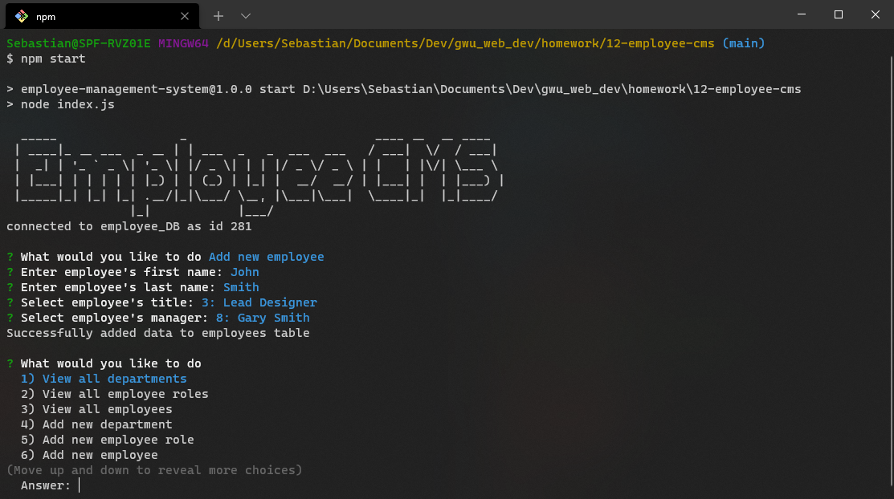
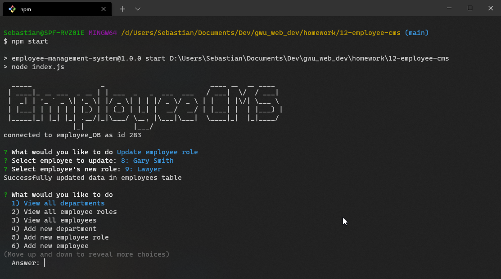
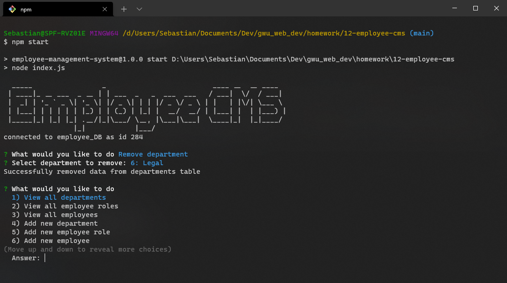

# **Employee Management System**
 &emsp;&emsp;

&nbsp;
## **Table of Contents**
  - [**Description**](#description)
  - [**Video Demonstration**](#video-demonstration)
  - [**Development/Application Screenshots**](#developmentapplication-screenshots)
  - [**Technologies and Services**](#technologies-and-services)
  - [**License**](#license)

&nbsp;
## **Description**
Employee Management System is a console based Content Management System (CMS) for interfacing and interacting with a company employee roster. A user initiates the application in the console using 
`node index.js`. The application then provides the user a menu from which they can choose to view or edit department, employee role, or employee data. 

This application is built with JavaScript and can be run using the Node.js runtime environment. On  initiation the application attempts a connection to the `employee_DB` database, which it needs for operation. The database stores department, employee role, and employee data in three separate tables that are linked through a set of foreign keys in each table. The table schemas are provided below.

&nbsp;
## **[Video Demonstration](https://youtu.be/z4xDjCrSHxc)**
&nbsp;
## **Development/Application Screenshots**

&nbsp;
## **Technologies and Services**
Development Technologies
- JavaScript, Node.js
- MySQL

External Packages, Frameworks, and Services
- [console.table](https://www.npmjs.com/package/console.table)
- [dotenv](https://www.npmjs.com/package/dotenv)
- [figlet](https://www.npmjs.com/package/figlet)
- [Inquirer](https://www.npmjs.com/package/inquirer)
- [mysql](https://www.npmjs.com/package/mysql)

&nbsp;
## **License**
Licensed under the [MIT](./LICENSE) license.